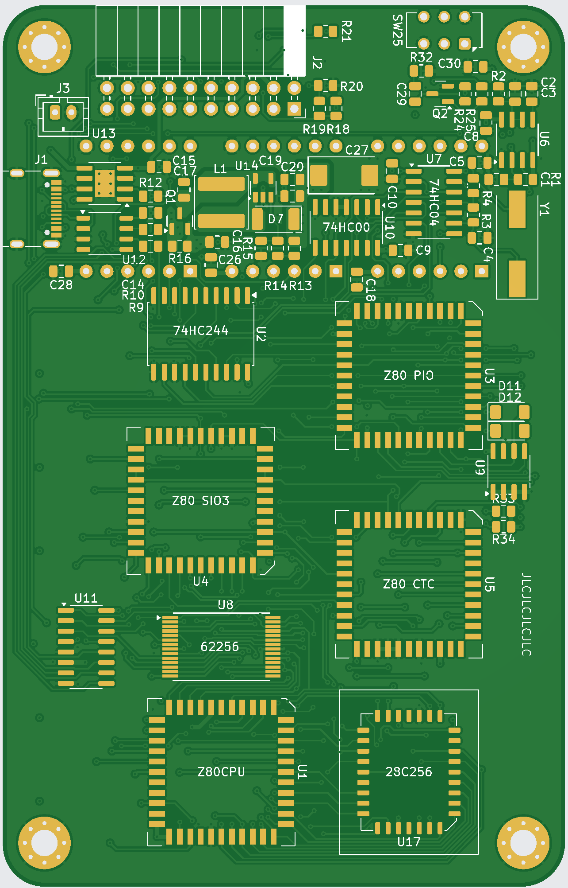

# Pocket80

Personal computer with monitor software that fits into a pocket. Successor to the
[Pocket265](https://github.com/agkaminski/Pocket265) with more features and more
powerful Z80 CPU onboard.

Key features:
- Z80 CPU @3.6864 MHz,
- 32 KB of SRAM,
- 32 KB of EEPROM,
- Z80 CTC:
    - interval system timer,
    - baudrate generator,
    - sound (via onboard piezo driver).
- Z80 SIO:
    - USB UART port,
    - expansion connector UART port,
    - baudrate of up to 14400 baud/s.
- Z80 PIO:
    - onboard 64 KB of I2C EERPOM memory,
    - heartbeat LED,
    - expansion connector GPIOs.
- Build-in LiPo battery:
    - USB-C battery charging circuitry,
    - battery level indicator.

## Memory map

| Start  | End    | Description |
|--------|--------|-------------|
| 0x0000 | 0x7FFF | ROM         |
| 0x8000 | 0xFFFF | RAM         |

## IO Map

| Start | End  | Description          |
|-------|------|----------------------|
| 0x00  | 0x1F | Z80 CTC              |
| 0x20  | 0x3F | Z80 SIO              |
| 0x40  | 0x5F | Z80 PIO              |
| 0x60  | 0x7F | Sound reset          |
| 0x80  | 0x9F | Keyboard             |
| 0xA0  | 0xBF | Display 1 (leftmost) |
| 0xC0  | 0xDF | Display 2            |
| 0xE0  | 0xFF | Display 3            |

## PCB visualisation

 
